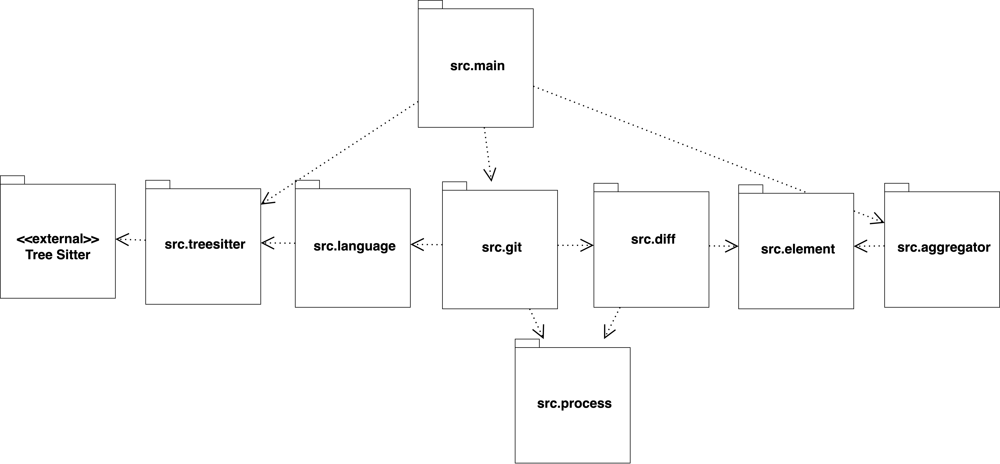

# JMT - INF2102

Several researches in the software engineering explore the mining of repositories (e.g Github). The main objective behind these explorations is to collect and analyze a the vastamount of data available in these domains, generating knowledge ranging from findings on the evolution of software, to the observation of the influence of human and social factors in software development.

When studying software evolution, it is common to collect data between system revisions, for instance software metrics, change metrics, code smells, or even semantic changes to the source code. However, to collect the changes in semantic elements on the source code it is necessary to build its ASTs (Abstract Syntax Trees). 
Through the AST it is possible to identify preciselly the elements that changed between revisions, in addition to their relationships with others.  

JMT is a multilanguage tool that manages Git repositories, and analyses changes between commits. Passing just the repository remote path, the tool yields a set of jsons (one per commit) containing: changed files, author informations, hunks of changes, and code elements impacted by the changes in the left file (before the change) and in the right file (after the change).

## Motivational example

Suppose we would like to examine one single commit (549a27a) in the [repository](https://github.com/correiajoao/Java.git). Looking for code elements impacted by the changes on that commit. 

The tool will provide us the following output:

        {
            "parent": "32cdf02afb448be9a47689c829005cf1e3719dc7",
            "date": "2022-01-02",
            "author": {
                "name": "Subh<supressed>",
                "email": "88422396+subhroblkb<supressed>"
            },
            "files": {
                "src/main/java/com/thealgorithms/ciphers/Caesar.java": {
                    "hunks": {
                        "337": {
                            "left_from": 93,
                            "left_to": 93,
                            "right_from": 94,
                            "right_to": 104,
                            "left_touched_elements": {
                                "2840": {
                                    "identifier": "class_declaration",
                                    "declaration": "Caesar",
                                    "start": 12,
                                    "end": 117,
                                    "body_preview": "public class Caesar {      /**..."
                                }
                            },
                            "right_touched_elements": {
                                "2841": {
                                    "identifier": "class_declaration",
                                    "declaration": "Caesar",
                                    "start": 12,
                                    "end": 139,
                                    "body_preview": "public class Caesar {      /**..."
                                },
                                "2842": {
                                    "identifier": "method_declaration",
                                    "declaration": "bruteforce",
                                    "start": 96,
                                    "end": 103,
                                    "body_preview": "public static String[] brutefo..."
                                },
                                "2843": {
                                    "identifier": "for_statement",
                                    "declaration": null,
                                    "start": 98,
                                    "end": 100,
                                    "body_preview": "for (int i=0; i<=26; i++) {   ..."
                                },
                                "2844": {
                                    "identifier": "binary_expression",
                                    "declaration": null,
                                    "start": 98,
                                    "end": 98,
                                    "body_preview": "i<=26..."
                                }
                            }
                        },
                        ...
                        ...
        }

Looking the output, we can see that one file has change (src/main/java/com/thealgorithms/ciphers/Caesar.java). In this file, there were one interval of changes impacting the line 93 in the left file and the interval 94 to 104 in the right file. For this interval of changes, in the left file a *class* called *Caesar* was impacted. In the right file, a *class* called *Caesar*, a *method* called *bruteforce*, a *for statement* and one *binary expression* were impacted by the changes.

# User Documentation

## Building 

In order to run this application, execute the following steps.

1. install the required packages:

    ```pip install -r requirements.txt```
    
2. Next, in the project root directory, clone the following repositories.
    ```
    git clone https://github.com/tree-sitter/tree-sitter-python
    git clone https://github.com/tree-sitter/tree-sitter-java
    ```
    
3. If you are a non unix user, install [gnudiff tool](https://www.gnu.org/software/diffutils/). You can run ```diff --version``` to check your installation. For unix users, this tool is provided by default, no actions are required.

## Testing

- [Test Guide and Logs](./docs/tests.md)

## Executing

To execute this application:

1. Go to the [main file](https://github.com/correiajoao/jmt/blob/main/src/main/main.py) and set the following parammeters.
- LANGUAGE: assumes the value Java() or Python(). 
        Indicates the language of the source code in the target repository.

- REMOTE_PATH: the url of the target repository.
        Indicates the remote path of the target repository.

- BRANCH: the target branch. 
        Indicates the branch in the repository that must be analysed.

2. Next, in the main method, there were four execution modes (as described in the Use Case Diagram). Choose the one that best fits your needs,              set the parameters file subset or commit subset if exists.
3. Then run the application.


See the example below. In this case we run the second execution mode, analysing only two commits.

```
        LANGUAGE = Java()
        REMOTE_PATH = "https://github.com/correiajoao/Java.git"
        BRANCH = "master"

        def main():
                hashs = ['2bcae52dce46dab3496fd6dc0b31cbe3716e891c', 'ec1ab53eeacbd9913206bb5ab98c1dd7dfe2ebbe']
                App().collect_all_file_commit_subset(REMOTE_PATH, BRANCH, LANGUAGE, hashs)
                '''
                Second execution mode.
                Collect data only for specific commits.
                '''

        if __name__ == "__main__":
            main()
```

## Requirements

### Functional

| ID    | Requirement                                                                                             |
|-------|---------------------------------------------------------------------------------------------------------|
| FR01  | The system should clone remote repositories locally.                                                    |
| FR02  | The system should delete a local repository, previously cloned (FR01).                                  |
| FR03  | The system should checkout a local repository (FR01), in a specific branch.                             |
| FR04  | The system should compute the full list of commits in a branch.                                         |
| FR05  | The system should compute information about the author of commits.                                      |
| FR06  | The system should compute modified files in commits.                                                    |
| FR07  | The system should be able to create diffs between two version of a file.                                |
| FR08  | Using diffs (FR07) the system should be able to extract hunks of changes.                               |
| FR09  | Using parsing libraries the system should build ASTs of source code files.                              |
| FR010 | The system should be able to navigate over ASTs (FR09), and identify code elements impacted by changes. |
| FR011 | The system should support the alaysis of repositories in Java and Python.                               |
| FR012 | The system should produce json files as output, one per commit.                                         |

### Non Functional

| ID    | Requirement                                                                |
|-------|----------------------------------------------------------------------------|
| NFR01 | The system should use the GNUDiff tool to generate diffs between files.    |
| NFR02 | The system should use TreeSitter as library for AST parsing.               |
| NFR03 | The system should support analysis of Git repositories.                    |
| NFR04 | The system should be extensible for support repositories in new languages. |


### Use Case Diagram


### Package Diagram


### Class Diagram

